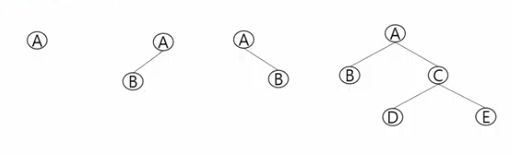

# 트리

- 비선형 구조
- 원소들 간 1:n 관계를 가짐
- 한 개 이상의 노드로 이뤄진 유한 집합, 다음 조건을 만족함
  - 루트: 노드 중 최 상위노드
  - 나머지 노드들은 n(>= 0)개의 분리 집합 T1, T2, T3,,, TN으로 분리될 수 있음.
  - T1, T2, T3...는 각각 하나의 트리가 됨(재귀적 정의)
    - 루트의 subtree라고 함.

## 용어

- 루트 노드: 트리의 시작 노드
- 잎 노드: 마지막 노드
- 간선: 노드를 연결하는 선
- 형제 노드: 같은 부모 노드를 가지고 있는 경우
- 조상 노드: 간선을 따라 루트 노드까지 이르는 경로에 있는 모든 노드들
- 서브 트리: 부모 노드와 연결된 간선을 끊었을 때 생성되는 트리
- 자손 노드: 서브 트리에 있는 하위 레벨의 노드들
- 차수
- 높이: 루트에서 노드에 이르는 간선의 수, 노드의 레벨

# 이진 트리

- 의미: 모든 노드들이 2개의 서브트리를 갖는 특별한 형태의 트리
- 각 노드가 자식 노드를 최대 2개까지만 가질 수 있음
  
- 레벨 i에서의 노드의 최대 수는 2 \*\* i 개
- 높이가 h 인 이진 트리가 가질 수 있는 노드의 최소 개수는 h + 1, 최대는 2 \*\* (h + 1) - 1 개

# Full Binary Tree

- 모든 레벨에 노드가 포화 상태로 차 있음
- 높이가 h일 때 2 \*\* (h + 1) - 1의 노드를 가짐
- 루트를 1번으로 하여 2 \*\* (h + 1) - 1까지 정해진 위치에 대한 노드 번호를 정함

## traversal: 트리의 노드들을 체계적으로 방문하는 것

- 전위 순회 preorder traversal: 부모 - 좌 - 우
- 중위 순회 inorder traversal: 좌 - 부모 - 우
- 후위 순회 postorder traversal: 좌 - 우 - 부모
  - 루트 노드를 제일 마지막에 방문함
