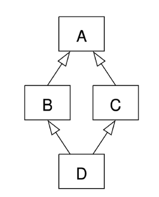

## 상속

한 클래스(부모)의 속성과 메서드를 다른 클래스(자식)가 물려받는 것

### 상속의 필요성

1. 코드의 재사용
   - 기존 클래스의 속성, 메서드를 재사용 가능
   - 기존 클래스를 수정하지 않고도 기능을 확장 가능
2. 계층 구조
   - 상속을 통해 클래스들 간의 계층 구조 형성 가능
   - 부모 클래스와 자식 간 관계를 표현, 더 구체적인 클래스를 생성할 수 있음
3. 유지보수의 용이성
   - 상속을 통해 기존 클래스의 수정이 필요한 경우, 해당 클래스만 수정하면 됨.
   - 코드의 일관성 유지, 수정이 필요한 범위를 최소화

### 메서드 오버라이딩

1. 부모 클래스의 메서드를 같은 이름, 같은 파라미터 구조로 재정의 하는 것
   - 자식 클래스가 부모 클래스의 메서드를 덮어 씀.

### 다중 상속 (Multiple Inheritance)

1. 둘 이상의 상위 클래스로부터 여러 행동이나 특징을 상속 받을 수 있는 것
2. 상속받은 모든 클래스의 요소를 활용 가능
3. 중복된 속성이나 메서드가 있는 경우 [상속 순서]()에 의해 결정됨

   - 먼저 상속받은 부모 속성/메서드를 반영
   - 다이아몬드 문제:

     

     - 두 클래스 B, C가 A에서 상속되고 클래스 D가 B, C 모두에서 상속될 때 발생하는 모호함
     - B, C가 재정의한 메서드가 A에 있고 D가 이를 재정의하지 않은 경우
       - D는 B와 C 중 어느느 메서드를 상속할까?
     - 해결책: [MRO]() 알고리즘을 이용해 클래스 목록을 생성
       - 검색을 깊이 우선, 왼쪽에서 오른쪽으로, 계층 구조에서 겹치는 같은 클래스를 두 번 검색 안함

### super()

1. 부모 클래스(또는 상위 클래스)의 메서드를 호출하기 위해서 사용하는 내장 함수
2. 기능: 다중 상송에서 특히 유용함. MRO를 따르기 때문에 여러 부모 클래스를 가진 자식 클래스에서 다음에 호출해야하는 부모 메서드를 순서대로 호출할 수 있도록 함.

3. 단일 상속에서의 예시

   ```python
   class Person:
       def __init__(self, name, age, number, email):
           self.name = name
           self.age = age
           self.number = number
           self.email = email

   class Student(Person):
       def __init__(self, name, age, number, email, student_id):
           super().__init__(name, age, number,email)
           self.student_id = student_id
   ```

   - 명시적으로 이름을 지정하지 않고 부모 클래스 참조 가능. 코드 유지보수에 용이.
   - 클래스 이름 변경/부모 클래스 교체 시에도 코드 수정이 줄어듦

4. 다중 상속에서의 예시

   ```python
   class ParentA:
       def __init__(self):
           super().__init__() # 1
           self.value_a = 'ParentA'

       def show_value(self):
           print(f'Value from ParentA: {self.value_a}')

   class ParentB:
       def __init__(self):
           self.value_b = 'ParentB'

       def show_value(self):
           print(f'Value from ParentB: {self.value_b}')

   class Child(ParentA, ParentB):
       def __init__(self):
           super().__init__()
           self.value_c = 'ParentC'

       def show_value(self):
           print(f'Value from ParentC: {self.value_c}')


   child = Child()
   child.show_value()

   ```

   - 1: child가 선언된 기준으로 MRO 상 부모(다음 클래스)는 ParentB
     - child 속성은 value_a, b, c 모두 갖게 되는 것

> MRO 확인 매직메서드
>
> - `ClassName.__mro__` 또는 `ClassName.mro()`

## 에러와 예외

### 디버깅

버그를 해결하는 과정

### 에러

1. 문법 에러 (Syntac Error)
   - 프로그램의 구문이 올바르지 않을 때
   - 오타, 괄호 누락 등

### 예외

- 프로그램 실행 중 감지되는 에러
- 예외 상황을 나타내는 예외 클래스들
  - 이미 정의됨, 특정 예외 상황에 대한 처리를 위해 사용
    <br>
    <br>
    ```python
    try:
        num = int(input('숫자 입력: '))
        print(10 / num)

    except (ZeroDivisionError, ValueError):
        print("한 번에 에러 처리 가능")

    except:
        print("언급하지 않은 에러 외 다른 에러 처리")

    else:
        print("except가 실행 안됐을 때 추가 작업")
        
    finally:
        print("오류 발생 여부와 상관 없이 항상 실행되어야 할 때")
    ```
- 내장 예외 클래스는 상송 계층 구조를 가지기 때문에 except 절로 분기 시 반드시 하위클래스를 먼저 거쳐갈 수 있도록 작성해야 됨.

  - ex) ZeroDivisionError의 경우 BaseException를 상속함. 그렇기 때문에 BaseException 뒤에 Zerodivision을 쓸 경우 BaseException에 모두 걸려서 Zerodivision까지 갈 수 없음.
  - 가장 구체적인 예외 > 범용적인 예외 순서로 처리

- as 키워드

  ```python
  my_list = []
  try:
      number = my_list[1]
  except IndexError as error:
      print(f"{error}가 발생했습니다.")

  # list index out of range가 발생했습니다.
  ```

### 예외처리와 값 검사

|                          EAFP                           |         LBYL          |
| :-----------------------------------------------------: | :-------------------: |
|      Easier to Ask for Forgiveness than Permission      | Look Before You Leap  |
|               예외 처리 중심의 코드 작성                | 값 검사를 중심으로 함 |
| 일단 실행하고 예외 처리<br>(예외가 발생한 후 예외 처리) | 실행하기 전 조건 검사 |
