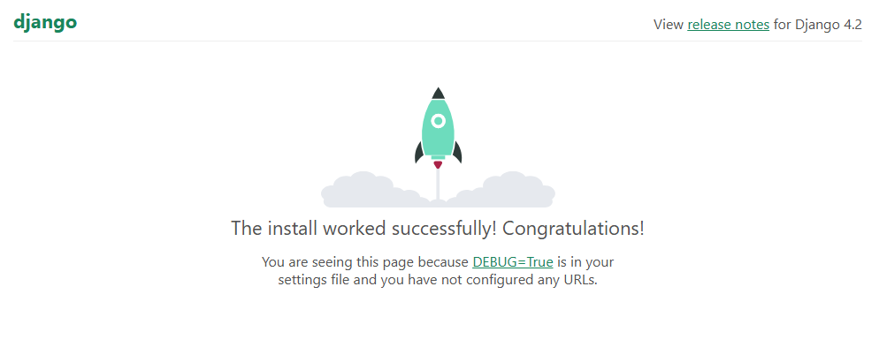
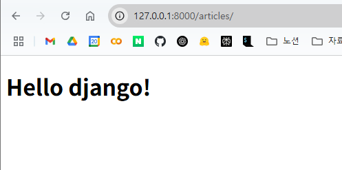

# django

## 가상 환경

### 가상 환경 생성

```
python -m venv venv
```

### 가상 환경 활성화

```
source venv/Scripts/activate
```

- `venv` 이라는 키워드로 활성화 여부 확인 가능

### 가상 환경 종료

```
deactivate
```

- 기본 global 환경으로 돌아옴

### 필요한 이유

- 프로젝트마다 다른 버전의 라이브러리 이용 가능
- 의존성 충돌 방지
  - 프로젝트 별로 라이브러리를 독립적으로 관리하게 해주어 여러 프로젝트가 동시에 같은 라이브러리를 쓰더라도 버전 충돌 문제를 예방해줌
- 협업 유용
  - 누구든 동일한 방식으로 가상환경을 생성, 같은 버전의 라이브러리를 설치하면 에러 가능성 줄일 수 있음

## 의존성

하나의 소프트웨어가 동작하기 위해 필요한 다른 소프트웨어나 라이브러리

### 의존성 패키지

프로젝트가 의존하는 개별 라이브러리들을 가리키는 말 (프로젝트 실행을 위해 꼭 필요한 하나하나의 패키지를 가리킴)

### 패키지 목록 확인

```
pip list
```

- global에서는
  ```
  $ pip list
  Package            Version
  ------------------ ----------
  certifi            2024.12.14
  charset-normalizer 3.4.1
  docker             7.1.0
  idna               3.10
  pip                22.0.4
  python-dotenv      1.0.1
  pywin32            310
  requests           2.32.3
  setuptools         58.1.0
  urllib3            2.3.0
  ```
- venv에서는

  ```
  Package    Version
  ---

  pip 22.0.4
  setuptools 58.1.0

  ```

### 의존성 기록

```
pip freeze
```

- 가상환경에 설칟된 모든 패키지를 버전과 함께 출력

```
pip freeze > requirements.txt
```

- requirement.txt 파일에 저장하는 방법
  - 나중에 동일한 환경 재현할 때 유용함
  - 파일명은 관례적으로 requirements
- 협업 시 팀원들도 같은 라이브러리 버전을 설치할 수 있기 때문에 유용

## 의존성 패키지 기반 설치

- requirements.txt을 활용해 다른 환경에서도 동일한 패키지 버전을 설치 가능

### 방법

- 가상환경 준비(생성, 활성화)
- 다음 명령어 입력

```
pip install -r requirements.txt
```

## 주의사항

- 가상 환경에 들어가고 나간다 X <-> 사용할 파이썬 환경을 On/Off 하는 것.
  - 가상환경 활성화는 현재 터미널 환경에만 영향을 미침
  - 새 터미널 창을 열면 다시 활성화 해야 함
- 프로젝트마다 별도의 가상환경 사용해야 함
- 일반적으로 가상 환경 폴더 venv는 관련한 프로젝트와 동일한 경로에 위치해야 함
- 폴더 venv는 .gitignore파일에 작성되어 원격 저장소에 공유되지 않아야 함
  - 저장소의 크기를 줄여 효율적인 협업과 배포를 가능하게 하기 위함
    - 대신 requirements.txt

## 명령어

```
pip install django
```

- 버전 명시 안하면 현재 파이썬 버전에 맞는 최신 버전이 설치 됨

```
django-admin startproject firstpjt .
```

- 현재 디렉토리(.)에 firstpjt라는 이름의 프로젝트 시작

```
python manage.py runserver
```

- 성공적으로 실행시 로컬 서버 생성 됨
  

- 끌 때는 ctrl + c

## 디자인 패턴

- 소프트웨어 설계에서 발생하는 문제를 해결하기 위한 일반적인 해결책 (공통적인 문제를 해결하는 데에 쓰이는 형식화 된 관행)
  = 애플리케이션은 이런 구조로 구성하자는 관행.

### MVC 디자인 패턴

- 애플리케이션을 삼등분: 모델, 뷰, 컨트롤러
  - 모델: 데이터
  - 뷰: 사용자 인터페이스
  - 컨트롤러: 비즈니스 로직
- 애플리케이션을 구조화하는 대표적인 패턴
- 시각적 요소와 뒷단에서 실행되는 로직을 서로 영향 없이, 독립적이고 쉽게 유지보수 할 수 있도록 함.

### MTV 디자인 패턴

- Model, Template, View
- Django에서 애플리케이션을 구조화하는 패턴, 명칭만 다르게 한 것
- MVC의 view가 Template, controller가 view

### Django project

- 애플리케이션의 집합
  - DB 설정, URL 연결, 전체 앱 설정 등을 처리

### Django application

    - 독립적으로 작동하는 기능 단위 모듈
    - 각자 특정 기능 담당, 다른 앱과 함께 하나의 프로젝트 구성

## 앱을 사용하기 위한 순서

### 1. 앱 생성

```
python manage.py startapp articles
```

- 앱의 이름은 복수형으로 지정하는 것을 권장함.
- 실행에 성공하면 articles라는 이름의 폴더가 생김
- firstpjt 안에 만들어지지 않음. 기능 단위의 [모듈](#1-앱-생성)이기 때문에, 프로젝트가 모듈을 가져오는 형태가 되는 것.

### 2. 앱 등록

- pjt 폴더 내 settings에서 INSTALLED_APPS에 추가하면 등록
- 등록 후 생성은 불가능

## 프로젝트 구조

### 봐야할 것들

- settings.py
  - 프로젝트의 모든 설정을 관리
- urls.py
  - 요청이 들어오는 URL에 따라 이에 해당하는 적절한 views를 연결

### 보지 않아도 됨

- **init**.py
  - 해당 폴더를 패키지로 인식하도록 설정하는 파일
- asgi.py
  - 비동기식 웹 서버와의 연결 관련 설정
  - 외부 클라우드에 올릴 때
- wsgi.py
  - 웹 서버와의 연결 관련 설정
- manage.py
  - Django 프로젝트와 다양한 방법으로 상호작용하는 커맨드 라인 유틸리티

## 앱 구조

### 봐야할 것들

- admin.py
  - 관리자용 페이지 설정
- models.py
  - DB와 관련한 모델을 정의
  - MTV 패턴의 M
- views.py
  - HTTP 요청을 처리하고 해당 요청에 대한 응답을 반환
    (url, model, template과 연계)
  - MTV의 V

### 안봐도 되는 것

- apps.py
  - 앱의 정보 작성됨
- test.py
  - 프로젝트 테스트 코드를 작성하는 곳

## 요청과 응답

|      |     |         |     |          |     |                          |     |
| :--: | :-: | :-----: | :-: | :------: | :-: | :----------------------: | :-: |
| 요청 | =>  | urls.py | ->  | views.py | <-> | models.py <br> templates |
|      |     |  응답   | <-  |          |     |

### 예시 - admin 페이지 열기

- 로컬 서버 url 뒤에 /admin 작성 후 enter

- firstpjt의 urls.py에서 이 부분이 실행 됨
  ```python
  urlpatterns = [
      path('admin/', admin.site.urls),
  ]
  ```
  - admin/: 열기 위한 주소 값
  - admin.site.urls: 실행될 행동

### articles 실습

- urls.py 파일

  ```python
  from articles import views

  urlpatterns = [
      path('admin/', admin.site.urls),
      path('articles/', views.index)  # 소괄호 열지 않음. 소괄호 쓰면 프로젝트 호출되면서 바로 실행되기 때문에.. 일종의의 호출 대기 상태.
  ]

  ```

- views.py(articles라는 앱 폴더 내에 있음)

  ```python
  def index(request):  #request 외의 이름을 쓸 순 있지만 그렇게 하지 않음!!!
      pass # 메인 페이지를 응답하는 역할을 할 것
  ```

- templates 폴더를 app 내에 만듦

  - 이후의 경로는 마음대로
  - articles 폴더 내 index.html 파일 생성
    ```html
    <html lang="en">
      <head>
        <meta charset="UTF-8" />
        <meta name="viewport" content="width=device-width, initial-scale=1.0" />
        <title>Document</title>
      </head>
      <body>
        <h1>Hello django!</h1>
      </body>
    </html>
    ```

- views.py 수정

  ```python
  def index(request):
      # 메인 페이지를 응답하는 역할을 할 것
      # 메인 페이지가 담겨있는 응답 객체를 반환
      return render(request, 'articles/index.html')  # 페이지를 객체와 합쳐 하나의 결과를 만듦
  ```

- url을 로컬 서버 주소/articles/로 수정하면
  
  - 위와 같은 화면 나옴

## 참고 사항

### git 관련

1. 가상 환경 생성
2. 가상 환경 활성화
3. django 설치
4. 패키지 목록 파일 생성(패키지 설치시마다 진행)
5. [.gitignore 파일 생성(첫 add 전)](#참고-사항---git-관련)
6. [git 저장소 생성(git init)](#참고-사항---git-관련)
7. Djnago 프로젝트 생성

- 5, 6 단계에서 깃

### 풀스택? 백엔드?

- 풀스택은 맞지만 프론트엔드 기능이 다른 전문적인 FE 프레임워크에 비해 매우 미흡
- 엄밀히 말하면 풀스택 영역의 백엔드에 속함
- 풀스택 혹은 BE framework라고 함
