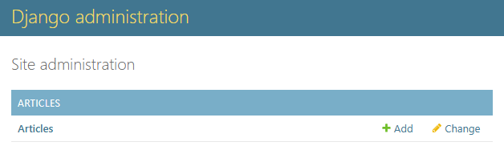
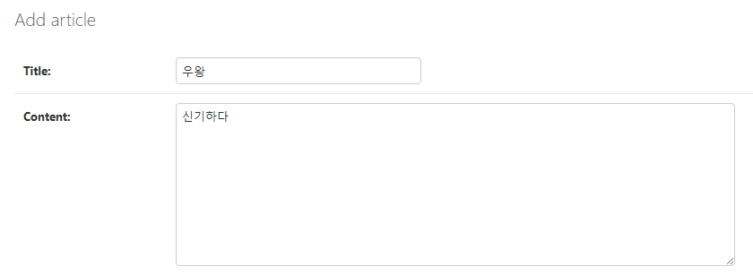
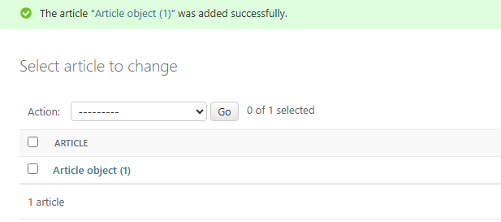
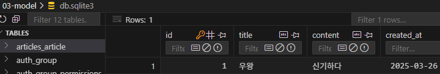

# 모델

## 모델을 이용한 DB 관리

### Django의 모델

- DB가 model 에 요청. 소통을 도와주는 역할
- DB 테이블을 정의하고 데이터를 조작(CRUD)할 수 있는 기능들을 제공. 테이블 구조를 설계하는 청사진
- DB를 직접 터치하진 않음. Django를 사용하기 때문에. model을 통해 간접적으로 제어.
  - DB는 SQL로 조작해야하지만 프레임워크를 통해 파이썬으로 간접적으로 관리하는 것
- 다수의 테이블에 대한 설계를 모델이 함. 클래스를 이용함.

### model 클래스 작성

```python
# articles/models.py

class Article(models.Model):
    title = models.CharField(max_length=10)
    content = models.TextField()
```

- 클래스 변수를 통해 DB의 Field(column) 이름을 지정할 수 있음
- Model Field
  - 데이터베이스 테이블의 열을 나타내는 중요한 구성 요소
  - 데이터의 유형(Field Types), 동작, 제약 조건(Field Options)을 정의함
    - `models.CharField`
    - `models.TextField`

# Model Field

## Field Types

- DB에 저장될 데이터의 종류 정의 (models 모듈의 Model 클래스)

### `models.CharField`

- 제한된 길이의 문자열 저장. 필드의 최대 길이 결정 (max_length)은 필수 옵션션

### `models.TextField`

- 길이 제한이 없는 대용량 txt 저장. 무한대는 아니고 사용하는 시스템에 따라 달라짐

## Field Options

- 필드의 동작과 제약 조건을 정의
- null: null 값 허용 여부 (False가 기본)
- blank: 빈 값을 form에서 허용할 지 여부 (False가 기본)
- default: 필드의 기본값 결정

# Migrations

- apps 폴더 내 migrations 폴더에 생성된 테이블이 쌓이게 됨

```
python manage.py makemigrations
```

- migrations 만듦: migrations 폴더 내에 최종 설계도가 저장됨(0001_initial.py 생성 됨)

```
python manage.py migrate
```

- 모델에서 DB로 옮김


- `앱이름_클래스이름`의 형태로 테이블이 생성됨

# 추가 Migrations

```python
class Article(models.Model):
    title = models.CharField(max_length=10)
    content = models.TextField()
    created_at = models.DateTimeField(auto_now_add=True)
    updated_at = models.DateTimeField(auto_now=True)
```

- `auto_now_add`: 데이터가 처음 생성될 때만 자동으로 현재 날짜 시간을 저장
- `auto_now`: 데이터가 저장될 때마다 자동으로 현재 날짜시간을 저장 (갱신)

## 추가 Migrations 시도

### python manage.py makemigrations

- 이 상태에서 python manage.py makemigrations 불가능

  - 기존에 있는 row들에서는 created_at, updated_at이 존재하지 않음. 따라서 현재 상황에서 필드를 추가 시 기존 row의 해당 필드들은 빈 칸이므로 무결성이 무너짐.
  - 그렇기 때문에 기본값 설정이 필요함
    - 설정에는 두 가지 옵션 존재
      1. django가 자동으로 해줌
      2. 직접 추가해야 함

- 1번 결과

  ```python
  class Migration(migrations.Migration):

      dependencies = [
          ('articles', '0001_initial'),
      ]
      ...
  ```

  - 의존성이 생김

### python manage.py migration

- 새로 생긴 설계도가 db.sqlite에 반영된 것 확인 가능

## 결론

1. 변경 사항이 생겼다면(model class 변경)
2. 반드시 새로운 설계도를 생성(makemigrations)
   - 새로운 설계도가 반영되지 않는 기존의 rows들을 위해 default 값 설정
3. 이를 DB에 반영(migrate)

> 참고)
>
> migrations에서 기록이 쌓여가는 이유: 버젼관리를 쉽게 하기 위해

# Admin Site

- Django는 추가 설치 및 설정 없이 자동으로 제공하는 관리자 인터페이스를 제공

- Admin 계정 만들기

  ```python
  python manage.py createsuperuser
  Username: admin
  Email address:
  Password:
  Password (again):
  ```

  - 첫 migrate할 때 auth_user 테이블이 생겼기 때문에 가능
  - password 칠 때 아무것도 안변하는데 정상임 반영되는 중이니 그냥 치면 됨

- /admin에서 로그인 가능
- app의 admin.py에 모델 클래스를 등록해야 해당 클래스 활용 가능
  
  - django admin 페이지에서 articles 테이블이 생성된 걸 확인할 수 있음
    
  - Article 테이블에서 Add article 작성 중
    
  - Article 객체가 추가된 걸 확인할 수 있음
    
  - VS code 상의 db에서도 확인 가능S

# 참고

### python manage.py showmigrations

- [X]로 DB 반영 여부 나타냄

### python manage.py sqlmigrate articles 0001

- 해당 migrations 파일이 SQL언어로 어떻게 번역되어 DB에 전달되는지 확인 가능
