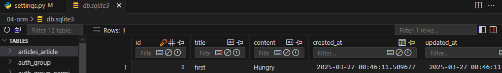
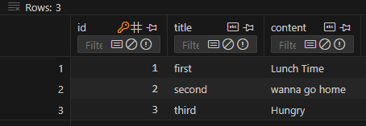
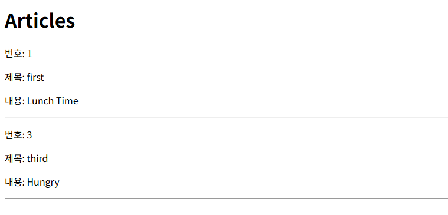

# ORM: object relational mapping

객체 지향 프로그래밍 언어를 이용해 호환되지 않는 유형의 시스템 간에 데이터를 변환하는 기술

## ORM의 역할

- Django와 DB 간에 사용하는 언어가 다르기 때문에 소통 불가
- Django에 내장된 ORM이 중간에서 이를 해석

# QuerySet API

- ORM에서 데이터를 필터링, 검색, 정렬 및 그룹화 하는 데에 사용하는 도구
- API를 이용해 SQL이 아닌 Python 코드로 데이터 처리
- python의 모델 클래스와 인스턴스를 활용해 DB에 데이터를 저장, 조회, 수정, 삭제 하는 것

```python
Article.objects.all()
```

- Article: model class
- objects: Manager
  - Manager를 통해 all이라는 메서드 호출
- all: Queryset API
  - 메서드

## Query Set

- 데이터베이스에게서 전달 받은 객체 목록(데이터 모음)
  - 순회가 가능한 데이터로써 1개 이상의 데이터를 불러와 사용 가능
- Django ORM 통해 만들어진 자료형
- 단, DB가 단일한 객체 반환할 시 QuerySet 아닌 ahepf(class)의 인스턴스로 반환됨

## CRUD

- SW가 가지는 기본적인 데이터 처리 기능
  - Create
  - Read
  - Update
  - Delete

# Django shell

- Django shell 안에서 실행되는 python shell
  - 입력하는 Queryset API

## 데이터 객체를 만드는 3가지 방법

### 1.

```python
In [4]: article = Article() # 객체 생성

In [5]: article  # 객체 확인
Out[5]: <Article: Article object (None)>

In [6]: article.title = 'first'  # 타이틀 작성

In [7]: article.content = 'Hungry'  # 내용 작성

In [8]: article  # 확인 해보면 아직 DB에 올라가지 않은 상태
Out[8]: <Article: Article object (None)>

In [10]: Article.objects.all()
Out[10]: <QuerySet []>  # 아무것도 없음

In [12]: article.save()  # 저장하고 나면

In [13]: article
Out[13]: <Article: Article object (1)>  # 하나 추가됨

In [14]: article.id
Out[14]: 1

In [15]: article.pk
Out[15]: 1

In [16]: Article.objects.all()
Out[16]: <QuerySet [<Article: Article object (1)>]>  # 전체 조회 시 조회 됨
```



- 위와 같이 추가된 것 db에서 확인 가능

## 2.

```python
In [17]: article = Article(title='second', content='wanna go home')

In [18]: article
Out[18]: <Article: Article object (None)>

In [19]: article.save()

In [20]: article
Out[20]: <Article: Article object (2)>

In [21]: Article.objects.all()
Out[21]: <QuerySet [<Article: Article object (1)>, <Article: Article object (2)>]>
```

### 3.

```python
In [22]: Article.objects.create(title="third", content="Hungry")
Out[22]: <Article: Article object (3)>
```

## 조회 메서드

### Return new QuerySets (반환 값이 있음 = 변수에 담을 수 있음)

- all()

  - 전체 데이터 조회

    ```python
    In [23]: articles = Article.objects.all()

    In [24]: articles
    # QuerySet 객체로 반환됨
    Out[24]: <QuerySet [<Article: Article object (1)>, <Article: Article object (2)>, <Article: Article object (3)>]>
    # 반복문 사용 가능
    In [25]: for article in articles:
        ...:     print(article.title)
        ...:
    first
    second
    third
    ```

- filter()
  - 주어진 매개변수와 일치하는 객체를 포함하는 QuerySet 반환
    - 결과가 한 개이건, 0개이건 상관없이 모두 Queryset으로 반환

### 하나만 조회

- get()

  ```python
      In [26]: article_get = Article.objects.get(content="Hungry")
  ---------------------------------------------------------------------------
  MultipleObjectsReturned                   Traceback (most recent call last)
  Cell In[26], line 1
  ----> 1 article_get = Article.objects.get(content="Hungry")

  File ~\AppData\Local\Programs\Python\Python39\lib\site-packages\django\db\models\manager.py:87, in BaseManager._get_queryset_methods.<locals>.create_method.<locals>.manager_method(self, *args, **kwargs)
      85 @wraps(method)
      86 def manager_method(self, *args, **kwargs):
  ---> 87     return getattr(self.get_queryset(), name)(*args, **kwargs)

  File ~\AppData\Local\Programs\Python\Python39\lib\site-packages\django\db\models\query.py:640, in QuerySet.get(self, *args, **kwargs)
      636 if not num:
      637     raise self.model.DoesNotExist(
      638         "%s matching query does not exist." % self.model._meta.object_name
      639     )
  --> 640 raise self.model.MultipleObjectsReturned(
      641     "get() returned more than one %s -- it returned %s!"
      642     % (
      643         self.model._meta.object_name,
      644         num if not limit or num < limit else "more than %s" % (limit - 1),
      645     )
      646 )

  MultipleObjectsReturned: get() returned more than one Article -- it returned 2!
  ```

  - primary key를 조회할 때만 쓰는 것!
  - 두 개 이상이거나 0개일 때도 오류 남

## Update

```python
In [27]: article_get = Article.objects.get(pk=1)

In [28]: article_get
Out[28]: <Article: Article object (1)>

In [29]: article_get.pk
Out[29]: 1

In [30]: article_get.content
Out[30]: 'Hungry'

In [31]: article_get.content = "Lunch Time"

In [32]: article_get.content
Out[32]: 'Lunch Time'

In [33]: article_get.save()
```



- 조회 > 원하는 것 변경 > 저장

## Delete

```python
In [34]: article_delete = Article.objects.get(pk=2)

In [35]: article_delete.delete()
Out[35]: (1, {'articles.Article': 1})
```

- 2번 글 사라짐

```python
In [36]: Article.objects.get(pk=2)
---------------------------------------------------------------------------
DoesNotExist                              Traceback (most recent call last)
Cell In[36], line 1
----> 1 Article.objects.get(pk=2)

File ~\AppData\Local\Programs\Python\Python39\lib\site-packages\django\db\models\manager.py:87, in BaseManager._get_queryset_methods.<locals>.create_method.<locals>.manager_method(self, *args, **kwargs)
     85 @wraps(method)
     86 def manager_method(self, *args, **kwargs):
---> 87     return getattr(self.get_queryset(), name)(*args, **kwargs)

File ~\AppData\Local\Programs\Python\Python39\lib\site-packages\django\db\models\query.py:637, in QuerySet.get(self, *args, **kwargs)
    635     return clone._result_cache[0]
    636 if not num:
--> 637     raise self.model.DoesNotExist(
    638         "%s matching query does not exist." % self.model._meta.object_name
    639     )
    640 raise self.model.MultipleObjectsReturned(
    641     "get() returned more than one %s -- it returned %s!"
    642     % (
   (...)
    645     )
    646 )

DoesNotExist: Article matching query does not exist.
```

# Django DB에 저장된 내용 불러오기

```python
# articles/views.py
from django.shortcuts import render
from .models import Article

# Create your views here.
def index(request):
    articles = Article.objects.all() # Django shell을 쓸 수 있다.
    context = {
        'articles': articles
    }
    return render(request, 'articles/index.html', context)
```

```html
<!DOCTYPE html>
<html lang="en">
  <head>
    <meta charset="UTF-8" />
    <meta name="viewport" content="width=device-width, initial-scale=1.0" />
    <title>Document</title>
  </head>
  <body>
    <h1>Articles</h1>
    
    <p>번호: {{article.pk}}</p>
    <p>제목: {{article.title}}</p>
    <p>내용: {{article.content}}</p>
    <hr />
    
  </body>
</html>
```



- 위와 같이 출력 가능

## Field Lookups

- \_\_(언더 바 두 개)로 필드명과 조회조건을 연결하여 쓸 수 있음
- exclude, filter 같은 데에 사용 가능
  - filter(content\_\_contains='H')
  - filter(title\_\_startwith='f')
