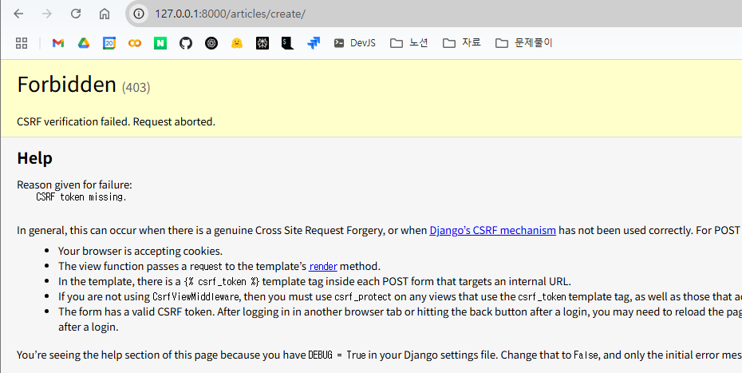

# 단일 게시글 조회

```python
# articles/urls.py
app_name = 'articles'
urlpatterns = [
    path('', views.index, name='index'),
    path('<int:pk>/', views.detail, name='detail')
]

# articles/views.py

# 특정 단일 게시글의 상세 페이지를 응답(* 단일 게시글 조회 필요)
def detail(request, pk):
    # pk로 들어온 정수 값을 활용해 DB의 아이디가 pk인 게시글을 조회 요청
    article = Article.objects.get(pk=pk)
    context = {
        'article': article
    }
    return render(request, 'articles/detail.html', context)

```

```html
<!DOCTYPE html>
<html lang="en">
  <head>
    <meta charset="UTF-8" />
    <meta name="viewport" content="width=device-width, initial-scale=1.0" />
    <title>Document</title>
  </head>
  <body>
    <h1>Articles</h1>
    <hr />
     전체 게시글 출력  
    <p>글 번호: {{ article.pk }}</p>
    <p>글 제목: {{ article.title }}</p>
    <a href=""
      ><p>글 내용: {{ article.content }}</p></a
    >
    <hr />
    
  </body>
</html>
```

```html
<!DOCTYPE html>
<html lang="en">
  <head>
    <meta charset="UTF-8" />
    <meta name="viewport" content="width=device-width, initial-scale=1.0" />
    <title>Document</title>
  </head>
  <body>
    <h1>DETAIL</h1>
    <h2>{{article.pk}} 번째 글</h2>
    <hr />
    <p>제목: {{article.title}}</p>
    <p>내용: {{article.content}}</p>
    <p>작성일: {{article.created_at}}</p>
    <p>수정일: {{article.updated_at}}</p>

    <a href="">[back]</a>
  </body>
</html>
```

- `<a href="">[back]</a> ` 이 부분에서 articles:index를 '' 안에 넣지 않으면 오류 남

# Create

- new: 사용자 입력 데이터를 받을 페이지를 랜딩
- create: 사용자가 입력한 요청 데이터를 받아 DB에 저장

```html
<!DOCTYPE html>
<html lang="en">
  <head>
    <meta charset="UTF-8" />
    <meta name="viewport" content="width=device-width, initial-scale=1.0" />
    <title>Document</title>
  </head>
  <body>
    <h1>NEW</h1>
    <form action="" method="GET">
      <div>
        <label for="title">Title: </label>
        <input type="text" name="title" id="title" />
      </div>
      <div>
        <label for="content">Content: </label>
        <textarea name="content" id="content"></textarea>
      </div>
      <input type="submit" />
    </form>
    <hr />
    <a href="">[back]</a>
  </body>
</html>
```

- name 필수
- for - id 같은 이름으로 하면 짝지어짐

```python
# articles/views.py

# 게시글을 작성하기 위한 페이지를 제공하는 함수
def new(request):
    return render(request, 'articles/new.html')


# 사용자로부터 데이터 받아 저장, 저장이 완료되었다는 페이지를 제공하는 함수
def create(request):
    # 사용자로부터 받은 데이터를 추출
    title = request.GET.get('title')
    content = request.GET.get('content')

    # DB에 저장
    Article.objects.create(title=title, content=content)
    return render(request, 'articles/create.html')
```

# HTTP request methods

## HTTP

네트워크 상에서 데이터(리소스)를 주고 받기 위한 약속

## HTTP request methods

- 데이터에 대해 수행을 원하는 작업(행동)을 나타내는 것
  - 서버에게 원하는 작업의 종류를 알려줌
- 클라이언트가 웹 서버에 특정 동작을 요청하기 위해 사용하는 표준 명령어
- 대표 메서드: GET, POST
  - GET: 조회용

### GET

- 서버로부터 데이터를 조회하는 것
- 데이터에 대한 변형, 수정 등을 수행하지 않음

  | 특징              | 설명                                                                                                                                                |
  | :---------------- | --------------------------------------------------------------------------------------------------------------------------------------------------- |
  | 데이터 전송       | URL 쿼리 문자열을 통해 데이터 전송                                                                                                                  |
  | 데이터 제한       | URL 길이에 제한이 있어 대량의 데이터 전송에 적합하지 않음                                                                                           |
  | 브라우저 히스토리 | 요청 URL이 브라우저 히스토리에 남음                                                                                                                 |
  | 캐싱              | 브라우저는 GET 요청의 응답을 로컬에 저장, 동일한 URL로 다시 요청할 때 서버로 새로 접속하는 게 아니라 저장된 결과 사용, 페이지 로딩 시간을 크게 단축 |

### POST

- 서버에 데이터를 제출해 리소스를 변경(생성, 수정, 삭제) 하는 데에 사용

  | 특징              | 설명                                                                                                      |
  | :---------------- | --------------------------------------------------------------------------------------------------------- |
  | 데이터 전송       | HTTP Body를 통해 데이터 전송                                                                              |
  | 데이터 제한       | GET에 비해 더 많은 양의 데이터 전송 가능                                                                  |
  | 브라우저 히스토리 | POST 요청은 브라우저 히스토리에 남지 않음                                                                 |
  | 캐싱              | POST 요청은 기본적으로 캐시할 수 없음, POST 요청이 일반적으로 서버의 상태를 변경하는 작업을 수행하기 때문 |

- 사용 예시
  - 로그인 정보 제출
  - 파일 업로드
  - 새 데이터 생성 (ex. 게시글 작성)
  - API에서 데이터 변경 요청

### 정리

- GET, POST는 보안 상 차이는 아님
- 각각의 특성에 맞게 사용해야.
  |GET|POST|
  |-|-|
  |데이터 조회|데이터 생성, 수정|

```html
<!DOCTYPE html>
<html lang="en">
  <head>
    <meta charset="UTF-8" />
    <meta name="viewport" content="width=device-width, initial-scale=1.0" />
    <title>Document</title>
  </head>
  <body>
    <h1>NEW</h1>
    <form action="" method="POST">
      <div>
        <label for="title">Title: </label>
        <input type="text" name="title" id="title" />
      </div>
      <div>
        <label for="content">Content: </label>
        <textarea name="content" id="content"></textarea>
      </div>
      <input type="submit" />
    </form>
    <hr />
    <a href="">[back]</a>
  </body>
</html>
```

- form tag의 method를 POST로 변경
- 다음과 같은 화면이 뜸
  

## HHTP response status code

- 서버가 클라이언트의 요청에 대한 처리 결과를 나타내는 세 자리 숫자
- 클라이언트에게 요청 처리 결과를 명확히 전달
- 문제 발생 시 디버깅에 도움
- 웹 애플리케이션의 동작을 제어하는 데에 사용

### 403 Forbidden

- 서버에 요청은 전달되었지만, 권한 때문에 거절되었다는 의미
- CSRF Token이 누락 됨
  - Cross Site Request Forgery: 사이트 간 요청 위조
    - 사용자가 자신의 의지와 무관하게 공격자가 의도한 행동을 해 특정 웹페이지를 보안에 취약하게 하거나 수정, 삭제 등의 작업을 하게 하는 공격 방법

```python
<!DOCTYPE html>
<html lang="en">
  <head>
    <meta charset="UTF-8" />
    <meta name="viewport" content="width=device-width, initial-scale=1.0" />
    <title>Document</title>
  </head>
  <body>
    <h1>NEW</h1>
    <form action="" method="POST">
      
      <div>
        <label for="title">Title: </label>
        <input type="text" name="title" id="title" />
      </div>
      <div>
        <label for="content">Content: </label>
        <textarea name="content" id="content"></textarea>
      </div>
      <input type="submit" />
    </form>
    <hr />
    <a href="">[back]</a>
  </body>
</html>
```

-  추가
- Method를 Post로 바꿀 경우 -> request.GET으로 가져온 방식을 바꿔줘야함.

```python
# 사용자로부터 데이터 받아 저장, 저장이 완료되었다는 페이지를 제공하는 함수
def create(request):
    # 사용자로부터 받은 데이터를 추출
    title = request.POST.get('title')
    content = request.POST.get('content')

    # DB에 저장
    # Article.objects.create(title=title, content=content)

    # 유효성 검사
    article = Article(title=title, content=content)
    article.save()
    return render(request, 'articles/create.html')
```

- request.POST.get 방식으로 바꿈

### 요청 시 CSRF 토큰을 함께 보내야 하는 이유

- Django가 직접 제공한 페이지에서 데이터를 작성하고 있는 것인지 확인하기 위한 수단.
- 겉모습이 같은 위조 사이트나 정상적이지 않은 요청에 대한 방어 수단

| 기존                      | 변경                                  |
| ------------------------- | ------------------------------------- |
| 요청 데이터 > 게시글 작성 | 요청 데이터 + 인증 토큰 > 게시글 작성 |

# Redirect
- 서버는 데이터 저장 후 페이지를 응답하는 것이 아닌 사용자를 적절한 기존 페이지로 보내야 함.
- 사용자를 보낸다 = 사용자가 GET 요청을 한 번 더 보내도록 해야함

```python
# 사용자로부터 데이터 받아 저장, 저장이 완료되었다는 페이지를 제공하는 함수
def create(request):
    # 사용자로부터 받은 데이터를 추출
    title = request.POST.get('title')
    content = request.POST.get('content')

    # DB에 저장
    # Article.objects.create(title=title, content=content)
    
    # 유효성 검사
    article = Article(title=title, content=content)
    article.save()
    return redirect('articles:detail', article.pk)
```
- render를 redirect로 변경
# Delete
- 조회 후 삭제 해야함
```python
urlpatterns = [
    path('', views.index, name='index'),
    path('<int:pk>/', views.detail, name='detail'),
    path('new/', views.new, name='new'),
    path('create/', views.create, name='create'),
    path('<int:pk>/delete/', views.delete, name='delete'),
]
```
- `'<int:pk>/delete/'` => 조회를 위한 경로
# Update
1. edit: 사용자의 입력을 받음
2. update: DB에 수정된 사항 저장장