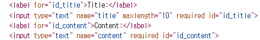
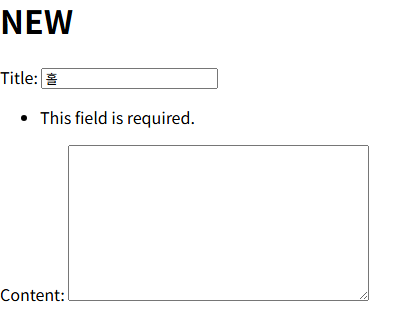

# Django Form

- 사용자 입력 데이터를 수집하고 처리 및 유효성 검사를 수행하기 위한 도구
- class로 선언

```python
from django import forms

class ArticleForm(forms.Form):
    title = forms.CharField()
    content = forms.CharField()
```

위와 같이 생성한 뒤

```PYTHON
#  views.py

# 게시글을 작성하기 위한 페이지를 제공하는 함수
def new(request):
    form = ArticleForm()
    context = {
        'form': form
    }
    return render(request, 'articles/new.html', context)

```

- views.py 수정

```html
    <div>
      <label for="title">Title: </label>
      <input type="text" name="title" id="title">
    </div>
    <div>
      <label for="content">Content: </label>
      <textarea name="content" id="content"></textarea>
    </div>
    <input type="submit">
    {{ form }}
  </form>
  <hr>
```

- {{ form }}이 다음과 같이 변경 됨
  

- {{ form.as_p }} 줄바꿈 하려면 이렇게

```python
class ArticleForm(forms.Form):
    title = forms.CharField(max_length=10)
    content = forms.CharField(widget=forms.Textarea)
```

- input의 표현을 변경하려면 widget 사용해야 함
  - 위의 코드의 경우 HTML을 확인하면 textarea 태그로 바뀌어 있음

# Form

- 사용자 입력을 받기는 하지만 DB에 저장하지 않을 때 (검색, 로그인 등)

# ModelForm

- 사용자 입력 데이터를 DB에 저장해야 할 때 (게시글 작성, 회원가입 등)

```python
class ArticleForm(forms.ModelForm):
    class Meta:
        model = Article
        fields = '__all__'
```

- model: 이 모델을 기준으로 만들어짐.
  - 모델이 CharField, TextField를 통해 사용자 입력을 받는다는 것을 파악해 자동으로 생성함

## Meta

- ModelForm의 정보를 작성하는 곳
- fields: 출력할 것들 고를 수 있음 (리스트 사용 가능)
- exclude: 출력하지 않을 필드를 지정 가능 (리스트 사용 가능)
- 파이썬의 inner class와 같은 문법적인 관점으로 접근하지 말 것

# 유효성 검사

## CREATE 수정

```python
# 사용자로부터 데이터를 받아 저장하고 저장이 완료되었다는 페이지를 제공하는 함수
def create(request):
    # 사용자로 부터 받은 데이터를 추출
    # title = request.POST.get('title')
    # content = request.POST.get('content')
    # article = Article(title=title, content=content)
    # article.save()

    form = ArticleForm(request.POST)  # 사용자에게서 받는 데이터 수와 상관 없이 모두 받을 수 있음
    # 저장하기 전 유효성 검사해야함
    if form.is_valid():
        # 유효성 검사 통과
        article = form.save() # save(): 작성된 객체를 반환함함
        return redirect('articles:detail', article.pk)
    # 유효성 검사 통과 못함
    # 현재 사용자가 게시글을 작성하는 템플릿을 다시 한 번 응답 (new template)
    context = {
        # 어떤 이유로 유효성 검사를 통과하지 못했는지에 관한 에러 메세지 포함

        'form': form,
    }
    return render(request, 'articles/new.html', context)
```

- 유효성 검사를 통과하지 못했을 때 (내용 부분에 빈 칸을 보냄)
  

### is_valid()

- 여러 유효성 검사를 실행
- 데이터가 유효한지 여부를 Boolean으로 반환
- `ModelForm`에 포함됨

### 공백 데이터가 유효하지 않은 이유

- DB는 기본적으로 빈 값을 허용하지 않음 (not null이란 조건이 들어감)
- 빈 값은 is_valid()에 의해 False로 평가되고, form 객체는 그에 맞는 에러 메시지가 포함되어 다음 코드로 진행 됨

## UPDATE

```python
def edit(request, pk):
    # 몇번 게시글 정보를 보여줄지 조회
    article = Article.objects.get(pk=pk)
    form = ArticleForm(instance=article)

    context = {
        'article': article,
        'form': form,
    }
    return render(request, 'articles/edit.html', context)
```

- `instance` 이용하면 form의 제목과 내용이 채워져 나옴

```python
def update(request, pk):
    # 어떤 글을 수정하는지 먼저 조회
    article = Article.objects.get(pk=pk)

    form = ArticleForm(request.POST)
    if form.is_valid():
        form.save()
        return redirect('articles:detail', article.pk)

    context = {
        'article': article,
        'form': form,
    }
    return render(request, 'articles/edit.html', context)
```

- update가 되지 않고 새로운 게시글이 생성됨: create 로직이기 때문

```python
def update(request, pk):
    # 어떤 글을 수정하는지 먼저 조회
    article = Article.objects.get(pk=pk)

    form = ArticleForm(request.POST, instance=article)
    if form.is_valid():
        form.save()
        return redirect('articles:detail', article.pk)

    context = {
        'article': article,
        'form': form,
    }
    return render(request, 'articles/edit.html', context)
```

- form에서 `instance`의 여부를 통해 save 메서드가 해당 글이 create인지 update인지를 구분하는 식
  - 있으면 UPDATE인 것

# HTTP 요청 다루기

|      | new                       | create                           |
| ---- | ------------------------- | -------------------------------- |
| 공통 | 데이터 생성을 목적으로 함 |                                  |
| 차이 | GET, 조회 요청만 옴       | POST, form을 통해 POST 요청만 옴 |

- 지금 들어온 요청이 GET인지 POST 인지를 구분할 수 있다면 두 함수를 하나로 합칠 수 있음!

## new와 create 합치기

```python
def create(request):
    # 1. 요청 메서드가 POST라면
    if request.method == 'POST':
        form = ArticleForm(request.POST)  # 사용자에게서 받는 데이터 수와 상관 없이 모두 받을 수 있음
        # 저장하기 전 유효성 검사해야함
        if form.is_valid():
            # 유효성 검사 통과
            article = form.save() # save(): 작성된 객체를 반환함함
            return redirect('articles:detail', article.pk)
        # 유효성 검사 통과 못함
        # 현재 사용자가 게시글을 작성하는 템플릿을 다시 한 번 응답 (new template)
    # 2. 요청 메서드가 POST가 아니라면
    else:  # 페이지 조회가 선행되어야 하기 때문에 흐름 상 else를 먼저 작성해야
        form = ArticleForm()
    context = {  # << #1
    'form': form
    }
    return render(request, 'articles/new.html', context)
```

- if request.method == 'POST' 내의 if form.is_valid()가 거짓인 경우
  - 에러 메시지를 담은 context(코드의 #1) 반환됨
- method == 'GET'인 경우
  - else를 거쳐 조회된 form을 반환 => 빈 form

### POST를 먼저 작성하는 이유

- else에 POST 외의 모든 경우가 포함되기 때문
  - GET, PUT, DELETE와 같은 메서드를 모두 포함

## update와 edit 합치기

```python
def update(request, pk):
    article = Article.objects.get(pk=pk)

    if request.method == 'POST':
        form = ArticleForm(request.POST, instance=article)
        if form.is_valid():
            form.save()
            return redirect('articles:detail', article.pk)
    else:
        form = ArticleForm(instance=article)
    context = {
        'article': article,
        'form': form,
    }
    return render(request, 'articles/update.html', context)
```
