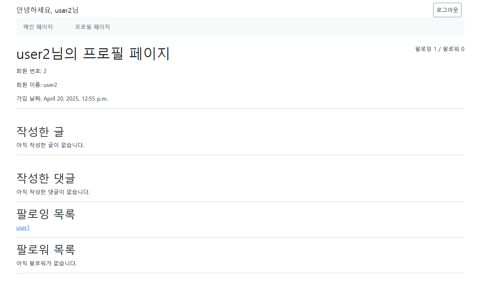

# 금융 프로젝트 프로필, 팔로잉, 팔로워 구현
## url
```python
app_name = 'accounts'
urlpatterns = [
    path('signup/', views.signup, name='signup'),
    path('login/', views.login, name='login'),
    path('logout/', views.logout, name='logout'),
    path('<int:user_pk>/profile/', views.profile, name='profile'),
    path('<int:user_pk>/follow/', views.follow, name='follow'),
]
```
- username을 사용하지 않고 pk로만 구분했다.
## view
```python
@login_required
def follow(request, user_pk):
    User = get_user_model()
    person = User.objects.get(pk=user_pk)
    if person != request.user:
        if request.user in person.followers.all():
            person.followers.remove(request.user)
        else:
            person.followers.add(request.user)
    
    return redirect('accounts:profile', person.pk)
```
- person을 어떻게 정의하느냐가 중요

## html
```html
<p>팔로잉
        {{ person.followings.all|length }}
        / 팔로워
        {{ person.followers.all|length }}</p>
```
- profile이 현재 로그인한 본인의 프로필에만 접근 가능하다고 이해해서 request.user로 썼다가 다른 사람의 프로필에도 접근 가능한 것이란 걸 깨닫고 person으로 교체


```html
    <div class="followings">
      <h2>팔로잉 목록</h2>
      
        
          <a href="">
            {{ following.username }}</a>
        
      
        <p>아직 팔로우한 사람이 없습니다.</p>
      
      <hr>
    </div>
    <div class="followers">
      <h2>팔로워 목록</h2>
      
        
          <a href="">
            {{ follower.username }}</a>
        
      
        <p>아직 팔로워가 없습니다.</p>
      
      <hr>
    </div>
```
## 구현 화면


## 마무리
1. 협업은 일의 능률을 올려준다는 점을 새삼 깨달았다. 병렬적으로 처리할 수 있는 일을 혼자 하다보니 시간이 더 오래 걸렸다.
2. 팔로우/팔로잉을 위해서는 profile에 user를 person과 같은 변수명으로 꼭 넘겨줘야한다는 걸 알았다. person 안만들어놓고 어떻게 이 페이지의 프로필 주인과 현재 로그인 중인 사람을 구별할 수 있지 고민하다 시간을 많이 뺏겼다.
3. 페이지의 적당한 위치를 고민하는 과정도 필요하다는 생각이 들었다. profile 같은 경우 board, comment와 같은 모델을 사용하기 때문에 boards에 넣을까 하다가 그래도 계정 관리인데 accounts에 넣는 게 맞는 거 같아 그렇게 진행했다.